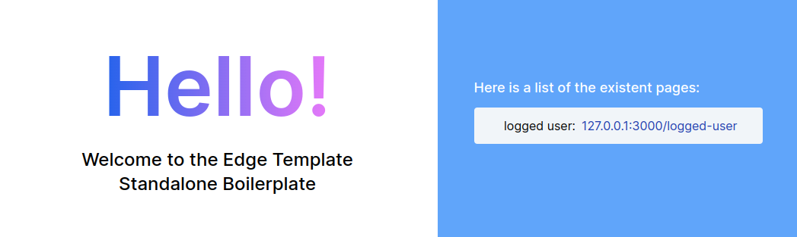

# Edge Template Standalone Boilerplate

<!-- Improved compatibility of back to top link: See: https://github.com/othneildrew/Best-README-Template/pull/73 -->
<a name="readme-top"></a>
<!--
*** Thanks for checking out the Best-README-Template. If you have a suggestion
*** that would make this better, please fork the repo and create a pull request
*** or simply open an issue with the tag "enhancement".
*** Don't forget to give the project a star!
*** Thanks again! Now go create something AMAZING! :D
-->


<!-- PROJECT SHIELDS -->
<!--
*** I'm using markdown "reference style" links for readability.
*** Reference links are enclosed in brackets [ ] instead of parentheses ( ).
*** See the bottom of this document for the declaration of the reference variables
*** for contributors-url, forks-url, etc. This is an optional, concise syntax you may use.
*** https://www.markdownguide.org/basic-syntax/#reference-style-links
-->
[![LinkedIn][linkedin-shield]][linkedin-url]
[![Contributors][contributors-shield]][contributors-url]
[![Forks][forks-shield]][forks-url]
[![Stargazers][stars-shield]][stars-url]

<!-- [![Issues][issues-shield]][issues-url]
[![MIT License][license-shield]][license-url] -->


<!-- PROJECT LOGO -->
<br />
<div align="center">
  <a href="https://github.com/edge-js/edge">
    
  </a>

<h3 align="center">Edge Template Standalone Boilerplate</h3>

  <p align="center">
    Edge is the official template for the AdonisJs framework. Although it is build on top of the AdonisJS framework, it is agonstic and can be used standalone as well.
    <br>
    This is a boilerplate project where you can build you Frontend logic and interactions. You may find it useful to implement and test your templates here before shipping it to the actual project.
    <!-- <br />
    <a href="https://github.com/eRRe-i/edge-template-standalone-boilerplate"><strong>Explore the docs »</strong></a> -->
    <br />
    <br />
    <a href="https://github.com/eRRe-i/edge-template-standalone-boilerplate">View Demo</a>
    ·
    <a href="https://github.com/eRRe-i/edge-template-standalone-boilerplate/issues">Report Bug</a>
    ·
    <a href="https://github.com/eRRe-i/edge-template-standalone-boilerplate/issues">Request Feature</a>
  </p>
</div>


<!-- TABLE OF CONTENTS -->
<details>
  <summary>Table of Contents</summary>
  <ol>
    <li><a href="#about-the-project">About The Project</a></li>
    <li><a href="#built-with">Built With</a></li>
    <li>
      <a href="#getting-started">Getting Started</a>
      <ul>
        <li><a href="#prerequisites">Prerequisites</a></li>
        <li><a href="#installation">Installation</a></li>
      </ul>
    </li>
    <!-- <li><a href="#usage">Usage</a></li>
    <li><a href="#roadmap">Roadmap</a></li>
    <li><a href="#contributing">Contributing</a></li>
    <li><a href="#license">License</a></li>
    <li><a href="#contact">Contact</a></li>
    <li><a href="#acknowledgments">Acknowledgments</a></li> -->
  </ol>
</details>


<!-- ABOUT THE PROJECT -->
## About The Project

The project was made to support the Frontend development of the UFRRJ's Alumni system. Details about this project can be seen here.

It used the HTTP module to create the server and setup the modules. It also uses TailwindCSS and Alpine 

<p align="right">[<a href="#readme-top">back to top</a>]</p>


## Built With

* [![Tailwind][TailwindCSS]][Tailwind-url]
* [![Adonis][AdonisJS]][AdonisJS-url]
* [![Node][Node.js]][Node-url]
* [![TS][TypeScript]][TypeScript-url]
* [![Alpine][Alpine.js]][Alpine-url]


<p align="right">[<a href="#readme-top">back to top</a>]</p>


<!-- GETTING STARTED -->
## Getting Started

This is an example of how you may give instructions on setting up your project locally.
To get a local copy up and running follow these simple example steps.

### Prerequisites

Be sure have node.js and npm intalled in your local machine.

### Installation

1. Clone the repo
   ```sh
   git clone https://github.com/eRRe-i/edge-template-standalone-boilerplate.git
   ```
2. Enter the project folder and install NPM packages
   ```sh
   cd edge-template-standalone-boilerplate/
   npm install
   ```
The pages used in the example uses Tailwind CSS. it is not necessary to install anything for the example to load. However if you need to make any changes to the base project, you may need to setup Tailwind. For more information, visit the [Tailwind installation page](https://tailwindcss.com/docs/installation) 

3. Install Tailwind dependencies
   ```sh
   npm run tailwind-install
   ```
4. Start the Tailwind CLI build process
   ```sh
   npm run tailwind
   ```
5. Run the nodemon script monitor to start the server 
   ```sh
   npm run nodemon
   ```

<p align="right">[<a href="#readme-top">back to top</a>]</p>


<!-- USAGE EXAMPLES -->
<!-- ## Usage

Use this space to show useful examples of how a project can be used. Additional screenshots, code examples and demos work well in this space. You may also link to more resources.

_For more examples, please refer to the [Documentation](https://example.com)_

<p align="right">[<a href="#readme-top">back to top</a>]</p> -->


<!-- ROADMAP -->
<!-- ## Roadmap

- [ ] Feature 1
- [ ] Feature 2
- [ ] Feature 3
    - [ ] Nested Feature

See the [open issues](https://github.com/github_username/repo_name/issues) for a full list of proposed features (and known issues).

<p align="right">[<a href="#readme-top">back to top</a>]</p> -->


<!-- CONTRIBUTING -->
<!-- ## Contributing

Contributions are what make the open source community such an amazing place to learn, inspire, and create. Any contributions you make are **greatly appreciated**.

If you have a suggestion that would make this better, please fork the repo and create a pull request. You can also simply open an issue with the tag "enhancement".
Don't forget to give the project a star! Thanks again!

1. Fork the Project
2. Create your Feature Branch (`git checkout -b feature/AmazingFeature`)
3. Commit your Changes (`git commit -m 'Add some AmazingFeature'`)
4. Push to the Branch (`git push origin feature/AmazingFeature`)
5. Open a Pull Request

<p align="right">[<a href="#readme-top">back to top</a>]</p> -->


<!-- LICENSE -->
<!-- ## License

Distributed under the MIT License. See `LICENSE.txt` for more information.

<p align="right">[<a href="#readme-top">back to top</a>]</p> -->


<!-- CONTACT -->
<!-- ## Contact

Your Name - [@twitter_handle](https://twitter.com/twitter_handle) - email@email_client.com

Project Link: [https://github.com/github_username/repo_name](https://github.com/github_username/repo_name)

<p align="right">[<a href="#readme-top">back to top</a>]</p> -->


<!-- ACKNOWLEDGMENTS -->
<!-- ## Acknowledgments

* []()
* []()
* []()

<p align="right">[<a href="#readme-top">back to top</a>]</p> -->


<!-- MARKDOWN LINKS & IMAGES -->
<!-- https://www.markdownguide.org/basic-syntax/#reference-style-links -->
[contributors-shield]: https://img.shields.io/github/contributors/eRRe-i/edge-template-standalone-boilerplate?style=for-the-badge
[contributors-url]: https://github.com/eRRe-i/edge-template-standalone-boilerplate/graphs/contributors

[forks-shield]: https://img.shields.io/github/forks/eRRe-i/edge-template-standalone-boilerplate?style=for-the-badge
[forks-url]: https://github.com/eRRe-i/edge-template-standalone-boilerplate/network/members

[stars-shield]: https://img.shields.io/github/stars/eRRe-i/edge-template-standalone-boilerplate?style=for-the-badge
[stars-url]: https://github.com/eRRe-i/edge-template-standalone-boilerplate/stargazers

<!-- [issues-shield]: https://img.shields.io/github/issues/github_username/repo_name.svg?style=for-the-badge
[issues-url]: https://github.com/github_username/repo_name/issues

[license-shield]: https://img.shields.io/github/license/github_username/repo_name.svg?style=for-the-badge
[license-url]: https://github.com/github_username/repo_name/blob/master/LICENSE.txt -->

[linkedin-shield]: https://img.shields.io/badge/LinkedIn-0077B5?style=for-the-badge&logo=linkedin&logoColor=white
[linkedin-url]: https://www.linkedin.com/in/leandro-bataglia-bb23b321/

<!-- [product-screenshot]: images/screenshot.png -->

[AdonisJS]: https://img.shields.io/badge/adonisjs-%23220052.svg?style=for-the-badge&logo=adonisjs&logoColor=white
[AdonisJS-url]: https://adonisjs.com/
[TailwindCSS]: https://img.shields.io/badge/tailwindcss-%2338B2AC.svg?style=for-the-badge&logo=tailwind-css&logoColor=white
[Tailwind-url]: https://tailwindcss.com/docs/installation
[Node.js]: https://img.shields.io/badge/node.js-6DA55F?style=for-the-badge&logo=node.js&logoColor=white
[Node-url]: https://nodejs.org/en/
[TypeScript]: https://img.shields.io/badge/typescript-%23007ACC.svg?style=for-the-badge&logo=typescript&logoColor=white
[TypeScript-url]: https://www.typescriptlang.org/
[Alpine.js]: https://img.shields.io/static/v1?style=for-the-badge&message=Alpine.js&color=222222&logo=Alpine.js&logoColor=8BC0D0&label=
[Alpine-url]: https://alpinejs.dev/

[Next.js]: https://img.shields.io/badge/next.js-000000?style=for-the-badge&logo=nextdotjs&logoColor=white
[Next-url]: https://nextjs.org/
[React.js]: https://img.shields.io/badge/React-20232A?style=for-the-badge&logo=react&logoColor=61DAFB
[React-url]: https://reactjs.org/
[Vue.js]: https://img.shields.io/badge/Vue.js-35495E?style=for-the-badge&logo=vuedotjs&logoColor=4FC08D
[Vue-url]: https://vuejs.org/
[Angular.io]: https://img.shields.io/badge/Angular-DD0031?style=for-the-badge&logo=angular&logoColor=white
[Angular-url]: https://angular.io/
[Svelte.dev]: https://img.shields.io/badge/Svelte-4A4A55?style=for-the-badge&logo=svelte&logoColor=FF3E00
[Svelte-url]: https://svelte.dev/
[Laravel.com]: https://img.shields.io/badge/Laravel-FF2D20?style=for-the-badge&logo=laravel&logoColor=white
[Laravel-url]: https://laravel.com
[Bootstrap.com]: https://img.shields.io/badge/Bootstrap-563D7C?style=for-the-badge&logo=bootstrap&logoColor=white
[Bootstrap-url]: https://getbootstrap.com
[JQuery.com]: https://img.shields.io/badge/jQuery-0769AD?style=for-the-badge&logo=jquery&logoColor=white
[JQuery-url]: https://jquery.com 
